## IMPORTAR EL MÓDULO `sys`
El módulo `sys` proporciona acceso a algunas variables utilizadas o mantenidas por el intérprete de Python y a funciones que interactúan fuertemente con el intérprete.

En el contexto de PyQt6 y muchas aplicaciones de interfaz gráfica de usuario (GUI) en general, ```import sys``` **se usa comúnmente al principio de un script** para permitir el manejo de argumentos de línea de comandos y para interactuar con el sistema.

## IMPORTAR CLASES DE PyQt:
**QApplication:** controlador de la aplicación.

**QWidget:** GUI básico y vacío.

*Ejemplo:*

    from PyQt6.QtWidgets import QApplication, QWidget

Ambos desde el QtWidgets módulo.<br>
**Los principales módulos de Qt son *QtWidgets* y *QtGui.QtCore*.** 

*Ejemplo:*

    import sys
    from PyQt6.QtWidgets import QApplication, QLabel

    app = QApplication(sys.argv)

    label = QLabel('¡Hola, mundo!')
    label.show()

    sys.exit(app.exec())

En este caso, `sys.argv` es utilizado para obtener los argumentos de la línea de comandos que se pasan al script. En aplicaciones de PyQt, **QApplication** se usa para inicializar la aplicación y manejar eventos de nivel superior. Luego, `sys.exit(app.exec())` se utiliza para asegurarse de que la aplicación se cierre correctamente cuando el usuario la cierra.

> [!NOTE]
> En Qt, *todos* los widgets de nivel superior **son ventanas**, es decir, no tienen un padre y **no están anidados dentro de otro widget** o diseño. Esto significa que técnicamente puedes crear una ventana usando cualquier widget que desees.

En este caso, estamos usando la clase **QLabel** donde obtenemos una ventana con una sola *etiqueta* que dice *¡Hola, mundo!*.

**QMainWindow:** widget prediseñado que proporciona muchas funciones de ventana estándar que utilizará en sus aplicaciones, incluidas barras de herramientas, menús, una barra de estado, widgets acoplables y más.

*Ejemplo:*
```
import sys

from PyQt6.QtCore import QSize, Qt
from PyQt6.QtWidgets import QApplication, QMainWindow, QPushButton


# Subclass QMainWindow to customize your application's main window
class MainWindow(QMainWindow):
    def __init__(self):
        super().__init__()

        self.setWindowTitle("My App")
        button = QPushButton("Press Me!")

        self.setFixedSize(QSize(400, 300))

        # Set the central widget of the Window.
        self.setCentralWidget(button)


app = QApplication(sys.argv)

window = MainWindow()
window.show()

app.exec()
```
> [!TIP]
> Si desea crear una **ventana personalizada**, el mejor enfoque es crear una **subclase QMainWindow** y luego incluir la configuración de la ventana en el `__init__` bloque. Esto permite que el **comportamiento** de la ventana sea **autónomo**.<br> ***Podemos agregar nuestra propia subclase de QMainWindow; llamándola MainWindow para simplificar las cosas.***

Para esta demostración usamos la clase **QPushButton**. *Los widgets principales de Qt siempre se importan desde el QtWidgets espacio de nombres, al igual que las clases QMainWindow y QApplication.*

En nuestro `__init__` bloque primero usamos `.setWindowTitle()` para cambiar el **título de nuestra ventana principal**. Luego agregamos nuestro primer widget, a **QPushButton, en el medio de la ventana**. Este es uno de los widgets básicos disponibles en Qt. Al crear el botón, **puede pasar el texto que desea que muestre el botón**.

En Qt los tamaños de ventanas y widgets se definen mediante un **QSize**. Esto acepta parámetros de ancho y alto en ese orden. **Por ejemplo**, `self.setFixedSize(QSize(400, 300))` creará una ventana de tamaño fijo de 400x300 píxeles.<br>
También puede llamar `.setMinimumSize()` y `.setMaximumSize()` para establecer los tamaños mínimo y máximo respectivamente.

Finalmente, llamamos `.setCentralWidget()` a la ventana. Esta es una **QMainWindow** función específica que te permite **configurar el widget que va en el medio de la ventana**.

## Signals (señales) y Slots (ranuras)

Las **señales** son notificaciones emitidas por widgets cuando sucede ***algo***. Ese algo puede ser cualquier cantidad de cosas, desde presionar un botón hasta cambiar el texto de un cuadro de entrada o cambiar el texto de la ventana.<br>
Las señales también pueden **enviar datos** para proporcionar contexto adicional sobre lo que sucedió.

**Slots** es el nombre que utiliza Qt para los **receptores de señales**. En Python, cualquier función (o método) de su aplicación se puede utilizar como ranura, simplemente conectándole la señal. Si la señal envía datos, la función de recepción también recibirá esos datos. Muchos widgets de Qt también tienen sus propias ranuras integradas, lo que significa que puede conectar los widgets de Qt directamente.

*Ejemplo:*
```
import sys

from PyQt6.QtWidgets import QApplication, QMainWindow, QPushButton

class MainWindow(QMainWindow):
    def __init__(self):
        super().__init__()

        self.setWindowTitle("My App")

        button = QPushButton("Press Me!")
        button.setCheckable(True)
        button.clicked.connect(self.the_button_was_clicked)
        button.clicked.connect(self.the_button_was_toggled)

        self.setCentralWidget(button)

    def the_button_was_clicked(self):
        print("Clicked!")

    def the_button_was_toggled(self, checked):
        print("Checked?", checked)


app = QApplication(sys.argv)

window = MainWindow()
window.show()

app.exec()
```

Ésta aplicación sencilla actualmente tiene un **QMainWindow** junto con un **QPushButton** como widget central. Hacemos que el botón sea "checkeable", lo que significa que puede tener dos estados: presionado o no presionado; con `button.setCheckable(True)`. Luego conectando este botón a dos métodos Python personalizados. Creamos una ranura (método) personalizada simple llamada `the_button_was_clicked` que acepta la `.clicked` señal de la clase **QPushButton** e imprimirá por consola **"Clicked!"** cada vez que se pulsa el botón. Luego creamos otro método `the_button_was_toggled` que conecta `.clicked` señal del botón con dicho método, esto significa que cuando el botón es presionado, se ejecutará el método `the_button_was_toggled` imprimiendo si el botón está "checked"(True) o no(False).

## Conectar widgets entre sí directamente
***Ejemplo:***
```
from PyQt6.QtWidgets import QApplication, QMainWindow, QLabel, QLineEdit, QVBoxLayout, QWidget

import sys


class MainWindow(QMainWindow):
    def __init__(self):
        super().__init__()

        self.setWindowTitle("My App")

        self.label = QLabel()

        self.input = QLineEdit()
        self.input.textChanged.connect(self.label.setText)

        layout = QVBoxLayout()
        layout.addWidget(self.input)
        layout.addWidget(self.label)

        container = QWidget()
        container.setLayout(layout)

        # Set the central widget of the Window.
        self.setCentralWidget(container)


app = QApplication(sys.argv)

window = MainWindow()
window.show()

app.exec()
```
Importamos las clases necesarias de PyQt6 para crear una ventana principal, una etiqueta **(QLabel)**, un campo de entrada de texto **(QLineEdit)**, un diseño vertical **(QVBoxLayout)**, y un widget **(QWidget)**.<br>
El método `def __init__(self)` es el constructor de la clase. Llama al constructor de la clase base **(QMainWindow)** mediante `super().__init__()` para asegurarse de que se inicialice correctamente.<br>
Creamos una etiqueta **(QLabel)** y la almacena en la variable `self.label`. Esta etiqueta se utilizará para mostrar texto en la interfaz gráfica.<br>
Creamos  un campo de entrada de texto **(QLineEdit)** y lo almacena en la variable `self.input`.<br>
Conectamos la señal `textChanged` del campo de entrada (`self.input`) al método `setText` de la etiqueta (`self.label`). **Esto significa que cuando el texto en el campo de entrada cambie, se actualizará el texto en la etiqueta.**<br>
Creamos un diseño vertical **(QVBoxLayout)** y agrega el campo de entrada (`self.input`) y la etiqueta(`self.label`) al diseño.<br>
Creamos un widget **(QWidget)** llamado ***container*** y establece el diseño vertical en este widget.<br>
Finalmente, establece el widget `container` como el widget central de la ventana principal.<br>
**En resumen, este código crea una ventana principal con un campo de entrada de texto y una etiqueta, donde el texto de la etiqueta se actualiza automáticamente cuando el usuario escribe en el campo de entrada.**

## Eventos
Cada interacción que el usuario tiene con una aplicación Qt es un **evento**. Hay muchos tipos de eventos, cada uno de los cuales representa un tipo diferente de interacción. Qt representa estos eventos utilizando ***objetos de evento*** que empaquetan información sobre lo que sucedió. Estos eventos se pasan a ***controladores de eventos*** específicos en el widget donde ocurrió la interacción.

Al definir ***controladores de eventos*** personalizados o extendidos, puede modificar la forma en que sus widgets responden a estos eventos. Los controladores de eventos se definen como cualquier otro método, pero el nombre es específico para el tipo de evento que manejan.

### Eventos del mouse:
Uno de los principales eventos que reciben los widgets es el **QMouseEvent**, se crean para todos y cada uno de los movimientos del mouse y clics en un botón en un widget. Los siguientes controladores de eventos están disponibles para manejar eventos del mouse:

| Controlador de eventos | Tipo de evento movido      |
|----------------------- |--------------------------- |
| mouseMoveEvent         | Ratón movido               |
| mousePressEvent        | Botón del ratón presionado |
| mouseReleaseEvent      | Botón del ratón liberado   |
| mouseDoubleClickEvent  | Doble clic detectado       |

Todos los eventos del mouse en Qt se rastrean con el **QMouseEventobjeto**, y la información sobre el evento se puede leer en los siguientes métodos de evento.

| Método       | Devoluciones                                                  |
| ------------ | ------------------------------------------------------------- |
| .button()    | Botón específico que desencadenó este evento                  |
| .buttons()   | Estado de todos los botones del mouse (indicadores OR)        |
| .position()  | Posición relativa del widget como un **QPoint** número entero |

## Widgets

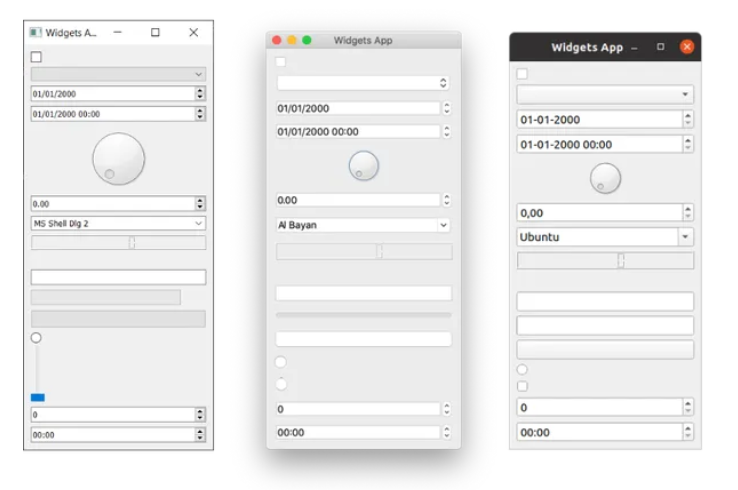

| widget         | Que hace                                                |
|--------------- | ------------------------------------------------------- |
| QCheckbox      | Una casilla de verificación                             |
| QComboBox      | Un cuadro de lista desplegable                          |
| QDateEdit      | Para editar fechas y fechas                             |
| QDateTimeEdit  | Para editar fechas y fechas                             |
| QDial          | Esfera giratoria                                        |
| QDoubleSpinbox | Una ruleta numérica para carrozas                       |
| QFontComboBox  | Una lista de fuentes                                    |
| QLCDNumber     | Una pantalla LCD bastante fea                           |
| QLabel         | Sólo una etiqueta, no interactiva.                      |
| QLineEdit      | Introduzca una línea de texto                           |
| QProgressBar   | Una barra de progreso                                   |
| QPushButton    | Un botón                                                |
| QRadioButton   | Un conjunto de alternancia, con un solo elemento activo |
| QSlider        | Un control deslizante                                   |
| QSpinBox       | Un girador de números enteros                           |
| QTimeEdit      | Para tiempos de edición                                 |

> [!IMPORTANT]
> Recuerda que para importar la línea del código es, por ejemplo:<br>
> ```
> import sys
> from PyQt6.QtWidgets import ( QMainWindow, QApplication, QLabel, QCheckBox,
>                               QComboBox, QListWidget, QLineEdit, QLineEdit,
>                               QSpinBox, QDoubleSpinBox, QSlider
>                              )
> from PyQt6.QtCore import Qt
> ```

### 1. QLabel:
Este es un texto simple de una línea. Puedes configurar el texto pasando un `str` a medida que lo creas:
```
widget = QLabel("Hello")
```
O, usando el método `.setText()`:
```
widget = QLabel("1")  # La etiqueta es creada con el texto 1.
widget.setText("2")   # La etiqueta ahora muestra el texto 2.
```
También se puede ajustar los parámetros de fuente, como el tamaño de la fuente o la alineación del texto en el widget.
```
widget = QLabel("Hello")
        font = widget.font()
        font.setPointSize(30)
        widget.setFont(font)
        widget.setAlignment(Qt.AlignmentFlag.AlignHCenter | Qt.AlignmentFlag.AlignVCenter)

        self.setCentralWidget(widget)
```
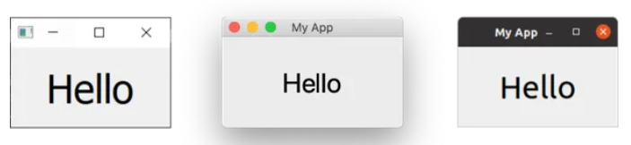

> [!TIP]
> Tenga en cuenta que si desea cambiar las propiedades de la fuente de un widget, generalmente es mejor obtener la fuente actual , actualizarla y luego volver a aplicarla. Esto garantiza que la fuente se mantenga en consonancia con las convenciones del escritorio.

La alineación se especifica mediante el uso de una bandera(Flag) del Qt.espacio de nombres. Las banderas(Flag) disponibles para **alineación HORIZONTAL** son:

| Bandera PyQt6 (nombre largo)  | Comportamiento                                      |
|------------------------------ | --------------------------------------------------- |
| Qt.AlignmentFlag.AlignLeft    | Se alinea con el borde izquierdo.                   |
| Qt.AlignmentFlag.AlignRight   | Se alinea con el borde derecho.                     |
| Qt.AlignmentFlag.AlignHCenter | Se centra horizontalmente en el espacio disponible. |
| Qt.AlignmentFlag.AlignJustify | Justifica el texto en el espacio disponible.        |

Las banderas disponibles para **alineación VERTICAL** son:

| Bandera PyQt6 (nombre largo)  | Comportamiento                                    |
| ----------------------------- |-------------------------------------------------- |
| Qt.AlignmentFlag.AlignTop     | Se alinea con la parte superior.                  |
| Qt.AlignmentFlag.AlignBottom  | Se alinea con la parte inferior.                  |
| Qt.AlignmentFlag.AlignVCenter | Se centra verticalmente en el espacio disponible. |

Finalmente, también hay una bandera abreviada que se centra en ambas direcciones simultáneamente:

| Bandera PyQt6                 | Comportamiento                        |
|----------------------------   |-------------------------------------  |
| Qt.AlignmentFlag.AlignCenter  | Se centra horizontal y verticalmente  |

Curiosamente, también puedes usar **QLabel** para mostrar una imagen usando `.setPixmap()`. Esto acepta un mapa de píxeles, que puede crear pasando un nombre de archivo de imagen a **QPixmap**. Se puede mostrar en la ventana de la siguiente manera:
```
widget.setPixmap(QPixmap('nombre_imagen.pgn'))
```
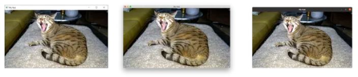

De forma predeterminada, la imagen se escala manteniendo su relación de aspecto. Si desea que se estire y escale para que se ajuste completamente a la ventana, puede configurarlo `.setScaledContents(True)` en el archivo **QLabel**.
```
widget.setScaledContents(True)
```

### 2. QCheckBox:
Presenta una casilla que el usuario puede marcar.
```
class MainWindow(QMainWindow):

    def __init__(self):
        super(MainWindow, self).__init__()

        self.setWindowTitle("My App")

        widget = QCheckBox()
        widget.setCheckState(Qt.CheckState.Checked)

        # For tristate: widget.setCheckState(Qt.PartiallyChecked)
        # Or: widget.setTriState(True)
        widget.stateChanged.connect(self.show_state)

        self.setCentralWidget(widget)


    def show_state(self, s):
        print(s == Qt.CheckState.Checked)
        print(s)
```
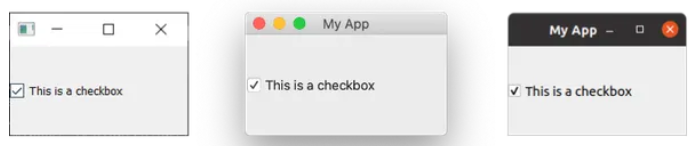

Puede establecer el estado de una casilla de verificación mediante programación usando `.setChecked` o `.setCheckState`. El primero acepta ***True*** o ***False***, representa marcado o no marcado respectivamente. Sin embargo, `.setCheckState` también especifica un estado marcado particular usando un Qt.indicador de espacio de nombres:

| Bandera PyQt6 (nombre largo)      | Comportamiento                            |
|---------------------------------- |------------------------------------------ |
| Qt.CheckState.Unchecked           | El artículo no está marcado               |
| Qt.CheckState.PartiallyChecked    | El artículo está parcialmente comprobado. |
| Qt.CheckState.Checked             | El artículo está marcado                  |

Una casilla de verificación que admite un estado parcialmente marcado ***(Qt.CheckState.PartiallyChecked)*** se conoce comúnmente como ***"tri-estado"***, es decir, ni activada ni desactivada. Una casilla de verificación en este estado comúnmente se muestra como una casilla de verificación atenuada y se usa comúnmente en disposiciones jerárquicas de casillas de verificación donde los subelementos están vinculados a las casillas de verificación principales.

Si establece el valor en ***Qt.CheckState.PartiallyChecked*** la casilla de verificación, se convertirá en triple. También puede configurar una casilla de verificación para que sea de tres estados sin configurar el estado actual como parcialmente marcado usando `.setTriState(True)`.

Puede notar que cuando se ejecuta el script, el número de estado actual se muestra como int con marcado = 2, sin marcar = 0 y parcialmente marcado = 1. No es necesario recordar estos valores, por ejemplo, la **Qt.Checkedvariable** de espacio de nombres. `== 2` Este es el valor de las respectivas banderas de estos estados. Esto significa que puedes probar el estado usando `state == Qt.Checked`.

### 3. QComboBox:
Es una lista desplegable, cerrada de forma predeterminada con una flecha para abrirla. Puede seleccionar un solo elemento de la lista y el elemento seleccionado actualmente se muestra como una etiqueta en el widget. El cuadro combinado es adecuado para seleccionar una opción entre una larga lista de opciones.

Se puede agregar elementos a **QComboBox** pasando una lista de cadenas a `.addItems()`. Los artículos se agregarán en el orden en que se proporcionen.

```
class MainWindow(QMainWindow):

    def __init__(self):
        super(MainWindow, self).__init__()

        self.setWindowTitle("My App")

        widget = QComboBox()
        widget.addItems(["One", "Two", "Three"])

        # Envía el índice actual (posición) del elemento seleccionado.
        widget.currentIndexChanged.connect( self.index_changed )

        # Hay una señal alternativa para enviar el texto.
        widget.currentTextChanged.connect( self.text_changed )

        self.setCentralWidget(widget)


    def index_changed(self, i): # i es un int
        print(i)

    def text_changed(self, s): # s es un str
        print(s)
```
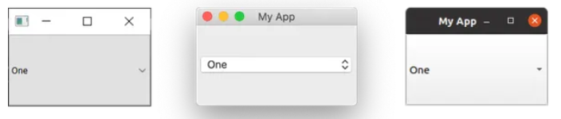

La señal `.currentIndexChanged` se activa cuando se actualiza el elemento seleccionado actualmente, pasando de forma predeterminada el índice del elemento seleccionado en la lista. También hay una señal `.currentTextChanged` que proporciona la etiqueta del elemento seleccionado actualmente, lo que suele ser más útil.

También puede ser editable, lo que permite a los usuarios ingresar valores que no están actualmente en la lista e insertarlos o simplemente usarlos como un valor. Para hacer que el cuadro sea editable:
```
widget.setEditable(True)
```

También puede establecer una bandera para determinar cómo se maneja la inserción. Estas banderas se almacenan en la propia clase **QComboBox** y se enumeran a continuación:

| Bandera PyQt6 (nombre largo)                  | Comportamiento                                |
|---------------------------------------------- |---------------------------------------------- |
| QComboBox.InsertPolicy.NoInsert               | Sin inserción                                 |
| QComboBox.InsertPolicy.InsertAtTop            | Insertar como primer elemento                 |
| QComboBox.InsertPolicy.InsertAtCurrent        | Reemplazar elemento actualmente seleccionado  |
| QComboBox.InsertPolicy.InsertAtBottom         | Insertar después del último elemento          |
| QComboBox.InsertPolicy.InsertAfterCurrent     | Insertar después del elemento actual          |
| QComboBox.InsertPolicy.InsertBeforeCurrent    | Insertar antes del elemento actual            |
| QComboBox.InsertPolicy.InsertAlphabetically   | Insertar en orden alfabético                  |

Para usarlos, aplique la bandera de la siguiente manera:
```
widget.setInsertPolicy(QComboBox.InsertPolicy.InsertAlphabetically)
```
También puede limitar la cantidad de elementos permitidos en el cuadro usando `.setMaxCount`, por ejemplo:
```
widget.setMaxCount(10)
```

### 4. QListWidget:
Este widget es similar a QComboBox, excepto que ***las opciones se presentan como una lista desplazable de elementos***. También ***admite la selección de varios elementos a la vez***. **QListWidget** ofrece una señal ***currentItemChanged*** que envía ***QListWidgetItem***(el elemento del widget de lista) y una señal ***currentTextChanged*** que envía el texto del elemento actual.

```
class MainWindow(QMainWindow):

    def __init__(self):
        super(MainWindow, self).__init__()

        self.setWindowTitle("My App")

        widget = QListWidget()
        widget.addItems(["One", "Two", "Three"])

        widget.currentItemChanged.connect(self.index_changed)
        widget.currentTextChanged.connect(self.text_changed)

        self.setCentralWidget(widget)


    def index_changed(self, i): # No es un índice, i es un QListWidgetItem
        print(i.text())

    def text_changed(self, s): # s es un str
        print(s)
```
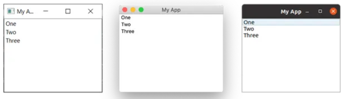

### 5. QLineEdit:
Es un cuadro de edición de texto simple de una sola línea, en el que los usuarios pueden escribir información. Se utilizan para campos de formulario o configuraciones donde no hay una lista restringida de entradas válidas. Por ejemplo, al ingresar una dirección de correo electrónico o el nombre de una computadora.

```
class MainWindow(QMainWindow):

    def __init__(self):
        super(MainWindow, self).__init__()

        self.setWindowTitle("My App")

        widget = QLineEdit()
        widget.setMaxLength(10)
        widget.setPlaceholderText("Enter your text")

        #widget.setReadOnly(True) # descomenta ésto para hacerlo readonly

        widget.returnPressed.connect(self.return_pressed)
        widget.selectionChanged.connect(self.selection_changed)
        widget.textChanged.connect(self.text_changed)
        widget.textEdited.connect(self.text_edited)

        self.setCentralWidget(widget)


    def return_pressed(self):
        print("Return pressed!")
        self.centralWidget().setText("BOOM!")

    def selection_changed(self):
        print("Selection changed")
        print(self.centralWidget().selectedText())

    def text_changed(self, s):
        print("Text changed...")
        print(s)

    def text_edited(self, s):
        print("Text edited...")
        print(s)
```
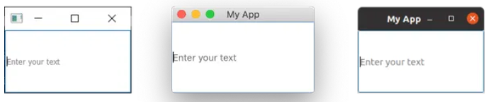

Como se demuestra en el código anterior, puede establecer una longitud máxima para el texto en una edición de línea.

Tiene una serie de señales disponibles para diferentes eventos de edición, incluido cuando se presiona retorno (por parte del usuario) y cuando se cambia la selección del usuario. También hay dos señales de edición, una para cuando se ha editado el texto del cuadro y otra para cuando se ha cambiado. La distinción aquí es entre ediciones de usuario y cambios programáticos. La señal `textEdited` solo se envía cuando el usuario edita texto.

Además, es posible realizar la validación de entrada utilizando una máscara de entrada para definir qué caracteres se admiten y dónde. Esto se puede aplicar al campo de la siguiente manera:
```
widget.setInputMask('000.000.000.000;_')
```
Lo anterior permitiría una serie de números de 3 dígitos separados por puntos, y por lo tanto podría usarse para validar direcciones IPv4.

### 6. QSpinBox y QDoubleSpinBox:
**QSpinBox** proporciona un pequeño cuadro de entrada numérica con flechas para aumentar y disminuir el valor. **QSpinBox** admite números enteros, mientras que el widget relacionado **QDoubleSpinBox** admite números decimales.
```
class MainWindow(QMainWindow):
    def __init__(self):
        super().__init__()

        self.setWindowTitle("My App")

        widget = QSpinBox()
        # Or: widget = QDoubleSpinBox()

        widget.setMinimum(-10)
        widget.setMaximum(3)
        # Or: widget.setRange(-10,3)

        widget.setPrefix("$")
        widget.setSuffix("c")
        widget.setSingleStep(3)  # Or e.g. 0.5 for QDoubleSpinBox
        widget.valueChanged.connect(self.value_changed)
        widget.textChanged.connect(self.value_changed_str)

        self.setCentralWidget(widget)

    def value_changed(self, i):
        print(i)

    def value_changed_str(self, s):
        print(s)
```
Si éste código se ejecuta se verá un cuadro de entrada numérica. El valor muestra las unidades de corrección previa y posterior y está limitado al rango de +3 a -10.

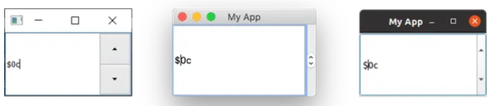

El código de demostración anterior muestra las diversas funciones disponibles para el widget.

Para establecer el rango de valores aceptables, puede usar `setMinimum` y `setMaximum`, o alternativamente usar `setRange` para configurar ambos simultáneamente. La anotación de tipos de valores se admite con prefijos y sufijos que se pueden agregar al número, por ejemplo, para marcadores de moneda o unidades se usan `.setPrefix` y `.setSuffix` respectivamente.

Al hacer clic en las flechas hacia arriba y hacia abajo en el widget, aumentará o disminuirá el valor en el widget en una cantidad, que se puede configurar usando `.setSingleStep`. Tenga en cuenta que esto no tiene ningún efecto sobre los valores aceptables para el widget.

Ambos **QSpinBox** y **QDoubleSpinBox** tienen una señal `.valueChanged` que se activa cada vez que se modifica su valor. La señal `.valueChanged` sin formato envía el valor numérico (ya sea un int o un float) mientras `.textChanged` envía el valor como una cadena, incluidos los caracteres de prefijo y sufijo.

Opcionalmente, puede desactivar la entrada de texto en la edición de línea del cuadro de número, configurándola en solo lectura. Con este conjunto, el valor sólo se puede cambiar usando los controles. Esto también tiene el efecto secundario de desactivar el cursor parpadeante.
```
widget.lineEdit().setReadOnly(True)
```

### 7. QSlider:
Proporciona un widget de barra deslizante, que funciona internamente de forma muy parecida a un archivo ***QDoubleSpinBox***. En lugar de mostrar el valor actual numéricamente, está representado por la posición del control deslizante a lo largo del widget. Esto suele ser útil cuando se proporciona ajuste entre dos extremos, pero cuando no se requiere una precisión absoluta. El uso más común de este tipo de widget es para controles de volumen.

Hay una señal `.sliderMoved` adicional que se activa cada vez que el control deslizante se mueve de posición y una señal `.sliderPressed` que se emite cada vez que se hace clic en el control deslizante.

```
class MainWindow(QMainWindow):
    def __init__(self):
        super().__init__()

        self.setWindowTitle("My App")

        widget = QSlider()

        widget.setMinimum(-10)
        widget.setMaximum(3)
        # Or: widget.setRange(-10,3)

        widget.setSingleStep(3)

        widget.valueChanged.connect(self.value_changed)
        widget.sliderMoved.connect(self.slider_position)
        widget.sliderPressed.connect(self.slider_pressed)
        widget.sliderReleased.connect(self.slider_released)

        self.setCentralWidget(widget)

    def value_changed(self, i):
        print(i)

    def slider_position(self, p):
        print("position", p)

    def slider_pressed(self):
        print("Pressed!")

    def slider_released(self):
        print("Released")
```
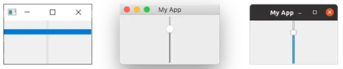

También puede construir un control deslizante con orientación vertical u horizontal pasando la orientación a medida que lo crea. Los indicadores de orientación se definen en el Qt. espacio de nombres. Por ejemplo:
```
widget = QSlider(Qt.Orientiation.Vertical)
```
ó
```
widget = QSlider(Qt.Orientiation.Horizontal)
```

### 8. QDial:
Es un widget giratorio que funciona igual que ***QSlider***, pero aparece como un dial analógico. Esto se ve bien, pero desde la perspectiva de la interfaz de usuario no es particularmente fácil de usar. Sin embargo, a menudo se utilizan en aplicaciones de audio como representación de diales analógicos del mundo real.

```
class MainWindow(QMainWindow):
    def __init__(self):
        super().__init__()

        self.setWindowTitle("My App")

        widget = QDial()
        widget.setRange(-10, 100)
        widget.setSingleStep(0.5)

        widget.valueChanged.connect(self.value_changed)
        widget.sliderMoved.connect(self.slider_position)
        widget.sliderPressed.connect(self.slider_pressed)
        widget.sliderReleased.connect(self.slider_released)

        self.setCentralWidget(widget)

    def value_changed(self, i):
        print(i)

    def slider_position(self, p):
        print("position", p)

    def slider_pressed(self):
        print("Pressed!")

    def slider_released(self):
        print("Released")
```

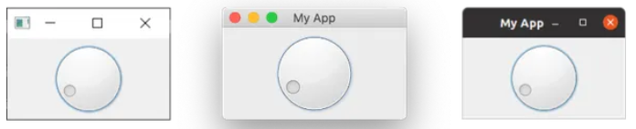

Las señales son las mismas que para QSlider y conservan los mismos nombres (p. ej. `.sliderMoved`).

## Diseños PyQt6
Hay 4 diseños básicos disponibles en Qt, que se enumeran en la siguiente tabla:

| Disposición       | Comportamiento                    |
|------------       |---------------------------------- |
| QHBoxLayout       | Diseño horizontal lineal          |
| QVBoxLayout       | Diseño vertical lineal            |
| QGridLayout       | En cuadrícula indexable XxY       |
| QStackedLayout    | Apilados (z) uno frente al otro   |

### 1. QVBoxLayout: widgets dispuestos verticalmente.
Se organizan los widgets uno encima del otro de forma lineal. Agregar un widget lo agrega al final de la columna.

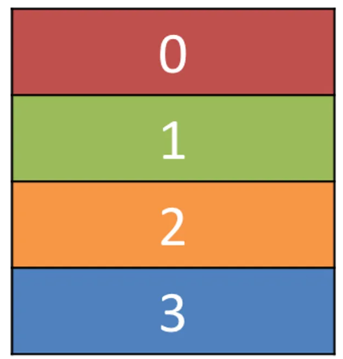

### [Ejemplo de clases QVBoxLayout](./ejemploQVBoxLayoutConBotones.py)

### 2. QHBoxLayout: widgets dispuestos horizontalmente.
Es el mismo, excepto que se mueve horizontalmente. Agregar un widget lo agrega al lado derecho.


### 3. Diseños de anidamiento:
Para diseños más complejos, puede anidar diseños uno dentro de otro usando `.addLayout`. A continuación agregamos a QVBoxLayout en el archivo principal QHBoxLayout. Si agregamos algunos widgets al QVBoxLayout, se organizarán verticalmente en la primera ranura del diseño principal.

```
class MainWindow(QMainWindow):

    def __init__(self):
        super(MainWindow, self).__init__()

        self.setWindowTitle("My App")

        layout1 = QHBoxLayout()
        layout2 = QVBoxLayout()
        layout3 = QVBoxLayout()

        layout1.setContentsMargins(0,0,0,0)
        layout1.setSpacing(20)

        layout2.addWidget(Color('red'))
        layout2.addWidget(Color('yellow'))
        layout2.addWidget(Color('purple'))

        layout1.addLayout( layout2 )

        layout1.addWidget(Color('green'))

        layout3.addWidget(Color('red'))
        layout3.addWidget(Color('purple'))

        layout1.addLayout( layout3 )

        widget = QWidget()
        widget.setLayout(layout1)
        self.setCentralWidget(widget)
```
Los widgets deben organizarse en 3 columnas horizontalmente, y la primera columna también debe contener 3 widgets apilados verticalmente.

Puede establecer el espacio alrededor del diseño usando `.setContentMargins` o establecer el espacio entre elementos usando `.setSpacing`.

### 4. QGridLayout: widgets dispuestos en una cuadrícula.
Permite colocar elementos específicamente en una cuadrícula. Se puede especificar las posiciones de filas y columnas para cada widget.


O se puede omitir elementos y quedarán vacíos.


```
class MainWindow(QMainWindow):

    def __init__(self):
        super(MainWindow, self).__init__()

        self.setWindowTitle("My App")

        layout = QGridLayout()

        layout.addWidget(Color('red'), 0, 0)
        layout.addWidget(Color('green'), 1, 0)
        layout.addWidget(Color('blue'), 1, 1)
        layout.addWidget(Color('purple'), 2, 1)

        widget = QWidget()
        widget.setLayout(layout)
        self.setCentralWidget(widget)
```

### [Ejemplo de clases QGridLayout](.//ejemploGridLayout.py)

### 5. QStackedLayout: múltiples widgets en el mismo espacio.
Permite colocar elementos directamente uno frente al otro. Luego puede seleccionar qué widget desea mostrar. Podrías usar esto para dibujar capas en una aplicación de gráficos o para imitar una interfaz tipo pestaña. Tenga en cuenta que también existe **QStackedWidget** un widget contenedor que funciona exactamente de la misma manera. Esto es útil si desea agregar una pila directamente a un **QMainWindow** con `.setCentralWidget`.

.png)

.png)

```
from PyQt6.QtWidgets import QStackedLayout  # Agregar éste import


class MainWindow(QMainWindow):
    def __init__(self):
        super().__init__()

        self.setWindowTitle("My App")

        layout = QStackedLayout()

        layout.addWidget(Color("red"))
        layout.addWidget(Color("green"))
        layout.addWidget(Color("blue"))
        layout.addWidget(Color("yellow"))

        layout.setCurrentIndex(3)

        widget = QWidget()
        widget.setLayout(layout)
        self.setCentralWidget(widget)
```
### [Ejemplo de clases QStackedLayout](./ejemploQStackedLayout.py)

Así es exactamente como funcionan las vistas con pestañas en las aplicaciones. Sólo una vista ("pestaña") es visible a la vez. Puede controlar qué widget mostrar en cualquier momento usando `.setCurrentIndex()` o `.setCurrentWidget()` configurando el elemento por el índice (en el orden en que se agregaron los widgets) o por el propio widget.

A continuación se muestra una breve demostración que se utiliza **QStackedLayout** en combinación con **QButton** para proporcionar una interfaz similar a una pestaña para una aplicación:
```
import sys

from PyQt6.QtCore import Qt
from PyQt6.QtWidgets import (
    QApplication,
    QHBoxLayout,
    QLabel,
    QMainWindow,
    QPushButton,
    QStackedLayout,
    QVBoxLayout,
    QWidget,
)

from layout_colorwidget import Color


class MainWindow(QMainWindow):
    def __init__(self):
        super().__init__()

        self.setWindowTitle("My App")

        pagelayout = QVBoxLayout()
        button_layout = QHBoxLayout()
        self.stacklayout = QStackedLayout()

        pagelayout.addLayout(button_layout)
        pagelayout.addLayout(self.stacklayout)

        btn = QPushButton("red")
        btn.pressed.connect(self.activate_tab_1)
        button_layout.addWidget(btn)
        self.stacklayout.addWidget(Color("red"))

        btn = QPushButton("green")
        btn.pressed.connect(self.activate_tab_2)
        button_layout.addWidget(btn)
        self.stacklayout.addWidget(Color("green"))

        btn = QPushButton("yellow")
        btn.pressed.connect(self.activate_tab_3)
        button_layout.addWidget(btn)
        self.stacklayout.addWidget(Color("yellow"))

        widget = QWidget()
        widget.setLayout(pagelayout)
        self.setCentralWidget(widget)

    def activate_tab_1(self):
        self.stacklayout.setCurrentIndex(0)

    def activate_tab_2(self):
        self.stacklayout.setCurrentIndex(1)

    def activate_tab_3(self):
        self.stacklayout.setCurrentIndex(2)


app = QApplication(sys.argv)

window = MainWindow()
window.show()

app.exec()
```
Quedaría así:
.png)

Qt en realidad proporciona un TabWidget incorporado que proporciona este tipo de diseño listo para usar, aunque en forma de widget. Debajo de la pestaña, la demostración se recrea usando **QTabWidget**:
```
import sys

from PyQt6.QtCore import Qt
from PyQt6.QtWidgets import (
    QApplication,
    QLabel,
    QMainWindow,
    QPushButton,
    QTabWidget,
    QWidget,
)

from layout_colorwidget import Color


class MainWindow(QMainWindow):
    def __init__(self):
        super().__init__()

        self.setWindowTitle("My App")

        tabs = QTabWidget()
        tabs.setTabPosition(QTabWidget.TabPosition.West)
        tabs.setMovable(True)

        for n, color in enumerate(["red", "green", "blue", "yellow"]):
            tabs.addTab(Color(color), color)

        self.setCentralWidget(tabs)


app = QApplication(sys.argv)

window = MainWindow()
window.show()

app.exec()
```

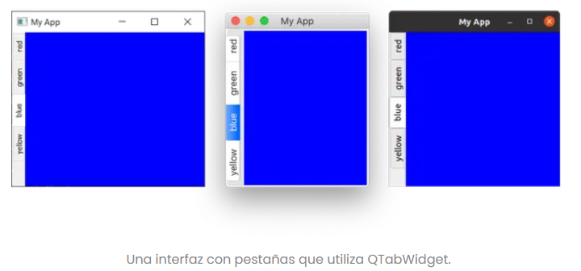

Como puede ver, es un poco más sencillo y un poco más atractivo. Puede establecer la posición de las pestañas usando las direcciones cardinales, alternar si las pestañas se pueden mover con `.setMoveable`. Notarás que la barra de pestañas de macOS se ve bastante diferente a las demás: de forma predeterminada, las pestañas de macOS tienen un estilo de pastilla o burbuja . En macOS, esto se utiliza normalmente para paneles de configuración con pestañas. Para los documentos, puede activar el modo de documento para obtener pestañas delgadas similares a las que ve en otras plataformas. Esta opción no tiene efecto en otras plataformas.
```
tabs = QTabWidget()
tabs.setDocumentMode(True)
```
### [Ejemplo de clases QTabWidget](./ejemploQTabWidget.py)

## Arquitectura ModelView
### QTableView: [Ejemplo de clases QTableView](./ejemploQTableView.py)
Es un widget de vista Qt que **presenta datos en una vista de tabla similar a una hoja de cálculo**. 
Como todos los widgets en Model View Architecture, este **utiliza un modelo separado** para proporcionar 
datos e información de presentación a la vista. **Los datos en el modelo se pueden actualizar** según sea
necesario y la vista notificada de estos cambios para volver a dibujar/mostrar los cambios. Al personalizar 
el modelo, es posible tener un gran control sobre cómo se presentan los datos.

**Para utilizar el modelo necesitaremos una estructura de aplicación básica y algunos datos ficticios**. 
A continuación se muestra un ejemplo de trabajo simple, que define un modelo personalizado que funciona 
con una lista anidada simple como almacén de datos.
```
import sys
from PyQt6 import QtCore, QtGui, QtWidgets
from PyQt6.QtCore import Qt


class TableModel(QtCore.QAbstractTableModel):
    def __init__(self, data):
        super(TableModel, self).__init__()
        self._data = data

    def data(self, index, role):
        if role == Qt.ItemDataRole.DisplayRole:
            # Consulta a continuación la estructura de datos de lista anidada.
            # .row() indexa en la lista externa,
            # .column() indexa en la sublista
            return self._data[index.row()][index.column()]

    def rowCount(self, index):
        # La longitud de la lista externa.
        return len(self._data)

    def columnCount(self, index):
        # Lo siguiente toma la primera sublista y devuelve
        # la longitud (solo funciona si todas las filas tienen la misma longitud)
        return len(self._data[0])


class MainWindow(QtWidgets.QMainWindow):
    def __init__(self):
        super().__init__()

        self.table = QtWidgets.QTableView()

        data = [
          [4, 9, 2],
          [1, 0, 0],
          [3, 5, 0],
          [3, 3, 2],
          [7, 8, 9],
        ]

        self.model = TableModel(data)
        self.table.setModel(self.model)

        self.setCentralWidget(self.table)


app=QtWidgets.QApplication(sys.argv)
window=MainWindow()
window.show()
app.exec()
```
Como en nuestros ejemplos anteriores de vista de modelo, creamos el widget **QTableView**, 
luego creamos una instancia de nuestro modelo personalizado (que hemos escrito para aceptar la fuente de datos como parámetro) 
y luego configuramos el modelo en la vista. Eso es todo lo que necesitamos hacer: el widget de vista ahora usa el modelo para 
obtener los datos y determinar cómo dibujarlos.
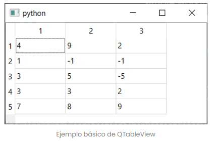

Para una tabla **necesitas una estructura de datos 2D, con columnas y filas**. Como se muestra en el ejemplo anterior, 
puedes modelar una estructura de datos 2D simple usando un Python anidado `list`. Nos tomaremos un minuto para analizar 
esta estructura de datos y sus limitaciones a continuación:
```
table = [
  [4, 1, 3, 3, 7],
  [9, 1, 5, 3, 8],
  [2, 1, 5, 3, 9],
]
```
### `list` Anidado como un almacén de datos bidimensional:
La lista anidada es una **"lista de listas de valores"**, una lista externa que contiene una serie de sublistas 
que a su vez contienen los valores. Con esta estructura, para indexar en valores individuales (o "celdas") debe 
indexar dos veces, primero para devolver uno de los objetos `list` internos y luego nuevamente para indexar en 
ese `list`.

La disposición típica es que la ***lista externa*** contenga las ***filas*** y cada ***lista anidada** contenga 
los valores de las ***columnas***. Con esta disposición, cuando indexa, **indexa primero por fila y luego por columna**, 
lo que convierte nuestro ***ejemplo table*** en una ***tabla de 3 filas y 5 columnas***. Afortunadamente, esto coincide 
con el diseño visual del código fuente.

El primer índice de la tabla devolverá una sublista anidada:
```
fila = 2
columna = 4

>>> table[fila]
[2, 1, 5, 3, 9]
```
Que luego indexas nuevamente para devolver el valor:
```
>>> table[fila][columna]
9
```
Tenga en cuenta que al utilizar **este tipo de estructura no puede devolver fácilmente una columna completa**; 
en su lugar, deberá iterar todas las filas. **Sin embargo, por supuesto, usted es libre de darle la vuelta a 
las cosas y usar el primer índice como columna** dependiendo de si le resulta más útil acceder por columna o fila.
```
table = [
  [4, 9, 2],
  [1, 1, 1],
  [3, 5, 5],
  [3, 3, 2],
  [7, 8, 9],
]

fila = 4  # al revés
columna = 2  # al revés

>>> table[columna]
[3, 5, 5]

>>> table[columna][fila]
9
```
### `QAbstractTableModel` Escribiendo una costumbre:
En la *arquitectura de vista de modelo*, el **modelo es responsable de proporcionar tanto los datos como los metadatos** 
de presentación para que los muestre la vista. **Para interactuar** entre nuestro objeto de datos y la vista, **necesitamos 
escribir nuestro propio modelo personalizado**, que comprenda la estructura de nuestros datos.

Para **escribir nuestro modelo personalizado podemos crear una subclase de QAbstractTableModel**. Los únicos métodos necesarios 
para un modelo de tabla personalizado son `data` , `rowCount` y `columnCount`. El **primero devuelve datos** (o información de presentación)
para ubicaciones determinadas en la tabla, mientras que **los dos últimos deben devolver un valor entero único para las dimensiones de la 
fuente de datos**.

> [!IMPORTANT]
> `QtCore.QAbstractTableModel` Es una *clase base abstracta*, lo que significa que **NO tiene implementaciones para los métodos**. 
> Si intentas usarlo directamente, no funcionará. Debes subclasificarlo.

En el constructor `__init__` aceptamos un único parámetro `data` que almacenamos como atributo de instancia `self._data` 
para que podamos acceder a él desde nuestros métodos. La estructura de datos pasada se almacena por referencia, por lo que cualquier 
cambio externo se reflejará aquí.

> [!NOTE]
> Para notificar al modelo sobre los cambios, debe activar la señal `layoutChanged` del modelo usando `self.model.layoutChanged.emit()`. 
> Consulte el [tutorial anterior de ModelView para obtener más información](https://www.pythonguis.com/tutorials/modelview-architecture/).

El método `data` se llama con dos valores `index` y `role`. El parámetro `index` proporciona la ubicación en la tabla para la que se solicita 
información actualmente y tiene dos métodos `.row()` y `.column()` que proporcionan el número de fila y columna en la vista respectivamente. 
En nuestro ejemplo, los datos se almacenan como una lista anidada y los índices de filas y columnas se utilizan para indexar de la siguiente 
manera `data[row][column]`.

El parámetro `role` **describe qué tipo de información debe devolver el método en esta llamada**. Para obtener los datos para mostrar la vista, 
llame a este método de modelo con la opción `Qt.ItemDataRole.DisplayRole`. Sin embargo, `role` puede tener muchos otros valores, incluidos 
`Qt.ItemDataRole.BackgroundRole` , `Qt.ItemDataRole.CheckStateRole` , `Qt.ItemDataRole.DecorationRole` cada uno de los cuales espera valores 
particulares como respuesta.

Los dos métodos personalizados `columnCount` y `rowCount` **devuelven el número de columnas y filas en nuestra estructura de datos**. 
En el caso de la disposición `list` anidado que estamos usando aquí, **el número de filas es simplemente el número de elementos en la lista externa, 
y el número de columnas es el número de elementos en una de las listas internas**, suponiendo que son todos iguales.

Para más opciones del `QAbstractTableModel`[pulsar aquí](https://www.pythonguis.com/tutorials/pyqt6-qtableview-modelviews-numpy-pandas/)

## USABILIDAD
### [Documento De Clase sobre Usabilidad](EstudioInterfacesGraficasUsuario(Usabilidad).pdf)

### 1. QMessageBox: Diálogos de mensajes simples
Esto se puede utilizar para crear cuadros de diálogo de **información, advertencia o preguntas**.
```
import sys

from PyQt6.QtWidgets import QApplication, QDialog, QMainWindow, QMessageBox, QPushButton


class MainWindow(QMainWindow):
    def __init__(self):
        super().__init__()

        self.setWindowTitle("My App")

        button = QPushButton("Press me for a dialog!")
        button.clicked.connect(self.button_clicked)
        self.setCentralWidget(button)

    def button_clicked(self, s):
        dlg = QMessageBox(self)
        dlg.setWindowTitle("I have a question!")
        dlg.setText("This is a simple dialog")
        button = dlg.exec()

        if button == QMessageBox.StandardButton.Ok:
            print("OK!")

app = QApplication(sys.argv)

window = MainWindow()
window.show()

app.exec()
```
¡Ejecutarlo! Verá un cuadro de diálogo simple con un **botón Aceptar**.

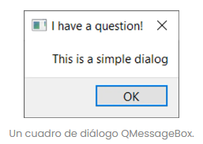

La lista completa de tipos de botones disponibles se muestra a continuación:
* QMessageBox.StandardButton.Ok
* QMessageBox.StandardButton.Open
* QMessageBox.StandardButton.Save
* QMessageBox.StandardButton.Cancel
* QMessageBox.StandardButton.Close
* QMessageBox.StandardButton.Discard
* QMessageBox.StandardButton.Apply
* QMessageBox.StandardButton.Reset
* QMessageBox.StandardButton.RestoreDefaults
* QMessageBox.StandardButton.Help
* QMessageBox.StandardButton.SaveAll
* QMessageBox.StandardButton.Yes
* QMessageBox.StandardButton.YesToAll
* QMessageBox.StandardButton.No
* QMessageBox.StandardButton.NoToAll
* QMessageBox.StandardButton.Abort
* QMessageBox.StandardButton.Retry
* QMessageBox.StandardButton.Ignore
* QMessageBox.StandardButton.NoButton

Puede construir una **línea de varios botones** uniéndolos mediante una operación **OR mediante una tubería (|)**. Qt manejará el pedido automáticamente, según los estándares de la plataforma.
**Por ejemplo, para mostrar un botón Sí y No usamos**:
```
buttons = QMessageBox.StandardButton.Yes | QMessageBox.StandardButton.No
```
**También puede modificar el ícono** que se muestra en el cuadro de diálogo configurándolo con una de las siguientes opciones:

| Estado del icono             | Descripción                                 |
|------------------------------|---------------------------------------------|
| QMessageBox.Icon.NoIcon      | El cuadro de mensaje no tiene ningún icono. |
| QMessageBox.Icon.Question    | El mensaje hace una pregunta.               |
| QMessageBox.Icon.Information | El mensaje es sólo informativo.             |
| QMessageBox.Icon.Warning     | El mensaje es de advertencia.               |
| QMessageBox.Icon.Critical    | El mensaje indica un problema crítico.      |

Por ejemplo, lo siguiente crea un cuadro de diálogo de preguntas con los botones Sí y No.
```
def button_clicked(self, s):
        dlg = QMessageBox(self)
        dlg.setWindowTitle("I have a question!")
        dlg.setText("This is a question dialog")
        dlg.setStandardButtons(QMessageBox.StandardButton.Yes | QMessageBox.StandardButton.No)
        dlg.setIcon(QMessageBox.Icon.Question)
        button = dlg.exec()

        if button == QMessageBox.Yes:
            print("Yes!")
        else:
            print("No!")
```
¡Ejecutarlo! Verá un cuadro de diálogo de preguntas con los **botones Sí y No**.
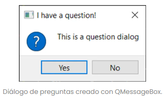

**Para simplificar aún más las cosas**, QMessageBoxtiene varios métodos que se pueden utilizar para construir este tipo de diálogos de mensajes.
Estos métodos se muestran a continuación:
* QMessageBox.about(parent, title, message)
* QMessageBox.critical(parent, title, message)
* QMessageBox.information(parent, title, message)
* QMessageBox.question(parent, title, message)
* QMessageBox.warning(parent, title, message)

El parámetro `parent` es la ventana de la que será hijo el diálogo. **Si está iniciando su cuadro de diálogo desde su ventana principal, puede simplemente pasar self**.

### [Ejemplo de clases QMessageBox](./ejemploQtSQLTableModel.py)